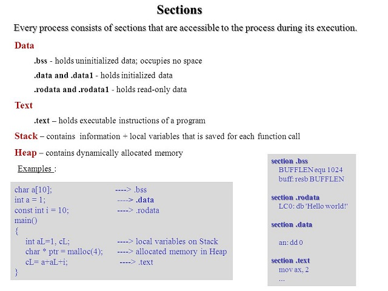

# Reading: Registers

Registers are the primary "tools" used to write programs in assembly language.
They are like variables built into the processor.
Using registers instead of direct memory addressing makes developing and reading assembly-written programs faster and easier.

Modern x86_64 processors have 16 general-purpose registers whose size is 64 bits.
Some of these are just extensions of the original 32-bit registers, while others are newly added (`r8` to `r15`).
The names of the registers are of historical nature (for example: `rax`'s ancestor, `eax`, was called the accumulator register because it is used by a series of arithmetic instructions, such as [idiv](https://www.felixcloutier.com/x86/idiv)).
While most registers have lost their special purpose, becoming "general purpose" in the modern ISA (`rax`, `rbx`, `rcx`, `rdx`, `rsi`, `rdi`, `rsp`, `rbp`), by convention, 2 have retained their initial purpose: `rsp` (stack pointer) and `rbp` (base pointer).

## Register Subsections

In certain cases, we want to manipulate values that are represented in less than 8 bytes.
For these situations, x86_64 processors offer us the possibility to work with subsections of the registers.

The image below represents the registers, their subsections, and their sizes.


>**WARNING**: Subsections are part of registers, which means that if we modify a register, we implicitly modify the value of the subsection.
>
>**NOTE**: Subsections are used in the same way as registers, only the size of the retained value is different.
>
>**NOTE**: Besides the basic registers, there are also six segment registers corresponding to certain areas as seen in the image:
>
>

## Static Memory Region Declarations

Static memory declarations (analogous to declaring global variables) in the x86_64 world are made through special assembly directives.
These declarations are made in the data section (the `.data` region).
Names can be attached to the declared memory portions through a label to easily reference them later in the program. Follow the example below:

```Assembly
.DATA
    var        db 64           ; Declares a byte containing the value 64. Labels
                               ; the memory location as "var".
    var2       db ?            ; Declares an uninitialized byte labeled "var2".
               db 10           ; Declares an unlabeled byte, initialized with 10. This
                               ; byte will be placed at the address (var2 + 1).
    X          dw ?            ; Declares an uninitialized word (2 bytes), labeled "X".
    Y          dd 3000         ; Declares a double word (4 bytes) labeled "Y",
                               ; initialized with the value 3000.
    Z          dq 4294967297   ; Declares a quad word (8 bytes) labeled "Z",
                               ; initialized with the value 4294967297 (2^32 + 1).
    ARR        dd 1,2,3        ; Declares 3 double words (each 4 bytes)
                               ; starting from address "ARR" and initialized with 1, 2, and 3, respectively.
                               ; For example, 3 will be placed at the address (ARR + 8).
    ARR64      dq 1,2,3        ; Declares 3 quad words (each 8 bytes)
                               ; starting from address "ARR64" and initialized with 1, 2, and 3, respectively.
                               ; For example, 3 will be placed at the address (ARR64 + 16).
```

> **NOTE**: DB, DW, DD, DQ are directives used to specify the size of the portion:
>
> Directive   | Role               | Size
> ----------- | ------------------ | ----
> `db`        | Define Byte        | 1 byte (8 bits)
> `dw`        | Define Word        | 2 bytes (16 bits)
> `dd`        | Define Double Word | 4 bytes (32 bits)
> `dq`        | Define Quad Word   | 8 bytes (64 bits)
>
> **NOTE**: There are multiple types of memory regions as can be seen in the image below:
>
> 

The last declarations in the above example represent the declaration of arrays.
Unlike higher-level languages, where arrays can have multiple dimensions and their elements are accessed by indices, in assembly language, arrays are represented as a number of cells located in a contiguous area of memory.
